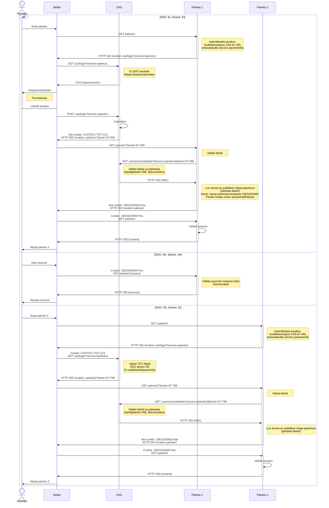
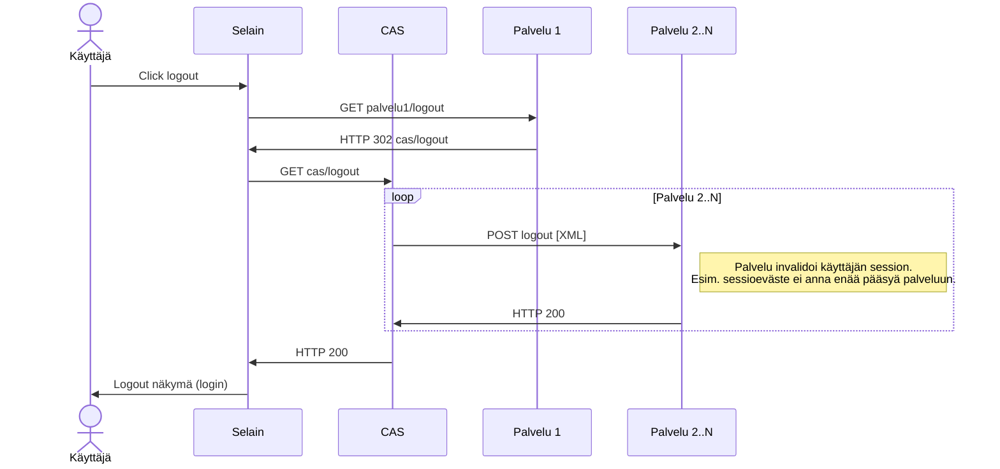

# CAS integraatio

Opintopolun palveluiden autentikaatio pohjautuu [CAS](https://www.apereo.org/cas) [protokollaan](https://apereo.github.io/cas/6.6.x/protocol/CAS-Protocol.html). Ulkoiset järjestelmät voivat tunnistautua käyttäen CAS:n [rest-rajapintaa](https://apereo.github.io/cas/6.6.x/protocol/REST-Protocol.html).

Tunnistautumisen jälkeen palvelut huolehtivat sessionhallinnastaan itse. Uloskirjautumien tapahtuu CAS:in [SLO]() toiminnon avulla joka invalidoi session palvelimelta. Huom: Selaimeen asetettuja evästeitä yms. ei voida näin poistaa joten on palvelun vastuulla pitää huolta ettei selaimen välimuistiin jää arkaluonteiseksi katsottavaa informaatiota.

Palvelukokonaisuuden autentikaatioon kannattaa katsoa mallia referenssitoteutuksista joita löytyy useille eri ohjelmointikielille

| Ohjelmointikieli | Linkki                                                                   |
| ---------------- | ------------------------------------------------------------------------ |
| Java             | https://github.com/Opetushallitus/java-utils/tree/master/java-cas        |
| Scala (2.11)     | https://github.com/Opetushallitus/scala-utils/tree/master/scala-cas_2.11 |
| Scala (2.12)     | https://github.com/Opetushallitus/scala-utils/tree/master/scala-cas_2.12 |
| Clojure          | https://github.com/Opetushallitus/clj-util/tree/master/clj-cas           |

Eduuni wikistä löytyy lukuisia aihetta käsittelivä artikkeleita (huom. mahdollinen pääsynrajaus).

- https://wiki.eduuni.fi/display/ophpolku/CAS-Oppijaan+integroituminen
- https://wiki.eduuni.fi/display/ophpolku/Rajapintojen+autentikaatio
- https://wiki.eduuni.fi/display/OPHPALV/Autentikaatiopalvelu+CAS

## Kirjautuminen

Login (GET) eli session muodostaminen palveluun tehdään samaan kirjautumisrajapintaan kuin logout (POST). Kirjautumisrajapinnan osoite välitetään CAS:ille **service** request parametrin avulla.

### Sisäänkirjautuminen

Mikäli pyydetty resurssi vaatii kirjautumista ohjaa palvelu käyttäjän CAS:iin. CAS huolehtii SSO session olemassaolosta ja palauttaa käyttäjän palvelun kirjautumisrajapintaan HTTP GET pyynnöllä jonka mukana on tarvittava tiketti (ST) jonka validoinnin yhteydessä palvelu saa selvitettyä tarvittavat käyttäjätiedot.
Tämä tarvitsee tehdä vain kerran jonka jälkeen palvelu hoitaa sessionhallinan itse (alla olevassa sekvenssikaaviossa esimerkinomaisesti perinteinen JSESSIONID eväste).

### Uloskirjautuminen

Palvelussa **ei** ole käytössä frontend [logout](https://apereo.github.io/cas/6.6.x/installation/Logout-Single-Signout.html) strategiaa vaan uloskirjautuminen tapahtuu puhtaasti taustajärjestelmissä.

CAS pitää kirjaa kaikista palveluista joihin on kirjauduttu SSO session aikana. Logout pyynnön tapahtuessa CAS lähettää jokaisen palvelun kirjautumisrajapintaan HTTP POST pyynnön joka sisältää tarvittavat tiedot (ST) jotta palvelu kykenee invalidoimaan ko. session.

Huomionarvoista on että logout tapahtuu palveluiden välillä ja näin ollen selaimesta ei saada siivottua esim. palvelukohtaisia evästeitä. Toteuttajan vastuulla on pitää huolta ettei välimuistiin jää arkaluonteiseksi katsottavaa informaatiota.

## Huomioita

- Palvelun kirjautumisrajapinta välitetään CAS:ille **service** parametrissä
- Palveluiden välillä kulkeva **service** parametri tulee olla asianmukaisesti URL enkoodattu
- Palveluiden väliset pyynnöt tarvitsevat asianmukaiset **Caller-Id** ja **CSRF** headerit.
- CAS hyväksyy palvelupyyntöjä vain sallituista osoitteista
