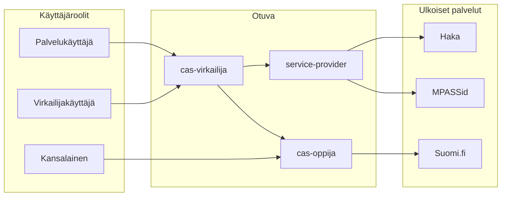

# Integraatiot

```mermaid
flowchart LR
    subgraph Käyttäjäroolit
        Virkailijakäyttäjä
        Kansalainen
        Palvelukäyttäjä
    end
    subgraph Otuva
        cas-virkailija
        cas-oppija
        service-provider
    end
    subgraph Ulkoiset palvelut
        Haka
        MPASSid
        Suomi.fi
    end

    Virkailijakäyttäjä --> cas-virkailija
    Kansalainen --> cas-oppija
    Palvelukäyttäjä --> cas-virkailija
    cas-virkailija --> service-provider
    service-provider --> Haka
    service-provider --> MPASSid
    cas-virkailija --> cas-oppija
    cas-oppija --> Suomi.fi
```